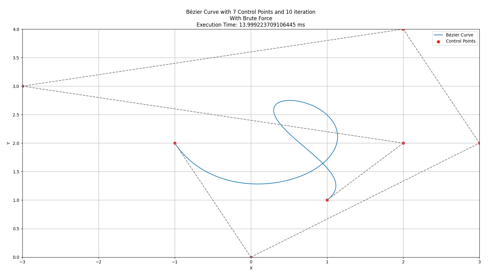

# Making Bezier Curve Using Divide and Conquer Approach

> This project is made using Python by applying the Divide and Conquer approach in the MidPoint algorithm to build a smooth Bezier Curve that uses N control points and I iterations.

## Table of Contents

- [General Info](#general-information)
- [Technologies Used](#technologies-used)
- [Features](#features)
- [Screenshots](#screenshots)
- [Setup](#setup)
- [Usage](#usage)
- [Project Status](#project-status)
- [Room for Improvement](#room-for-improvement)
- [Acknowledgements](#acknowledgements)
- [Contact](#contact)

## General Information

- This project was made to fulfill our second task in Algorithm Strategies course in order to use the Divide and Conquer algorithm for practical use cases.
- This project is aimed at showing how powerful a good Divide and Conquer approach can be in terms of increasing the performance speed of one's code.
- With this project, we hope people can see more about the use cases of the Divide and Conquer approach.

## Technologies Used

- Python

## Libraries Used

- matplotlib
- time
- dataclasses
- numpy

## Features

List the ready features here:

- Generate Bezier Curve with Brute Force Algorithm
- Generate Bezier Curve with Divide and Conquer Algorithm
- Displaying the final display
- Displaying the final process of making the Bezier Curve with the Divide and Conquer Algorithm and displaying the final result

## Screenshots





## Setup

```bash
git clone https://github.com/ImanuelSG/Tucil2_13522005_13522058.git
cd Tucil2_13522005_13522058
cd src
python main.py
```

## Usage

To add a test case file, please navigate to the test/input folder and provide a txt file. You will be prompted to enter the filename (example : tes1.txt)

```bash
N = Number of Control Points
x1 y1
x2 y2
xN yN
```

for example with 3 Control Points

```bash
3
1 0
2 1
4 1
```

## Project Status

| Poin                                                                   | Ya      | Tidak |
| ---------------------------------------------------------------------- | ------- | ----- |
| 1. Program berhasil dijalankan.                                        | ☑ |       |
| 2. Program dapat melakukan visualisasi kurva Bézier.                   | ☑ |       |
| 3. Solusi yang diberikan program optimal.                              | ☑ |       |
| 4. [Bonus] Program dapat membuat kurva untuk n titik kontrol.          | ☑ |       |
| 5. [Bonus] Program dapat melakukan visualisasi proses pembuatan kurva. | ☑ |       |

## Room for Improvement

There are a lot of things that can be developed more from this project since this program is still relatively simple.

Room for improvement:

- Better algorithm and argument passing
- Improved animation methods

To do:

- Add better animation to make the process more visible
- Develop a better GUI for easier input (website if possible)

## Acknowledgements

- Biggest thanks to Dr. Nur Ulfa Maulidevi, S.T, M.Sc as our lecturer
- Biggest thanks to the internet for being such a wonderful place to search for something
- Biggest thanks to all our friends who have helped us to develop this program

## Contact

Created by:

| Name                      | NIM      | Contact                     |
| ------------------------- | -------- | --------------------------- |
| Ahmad Naufal Ramadhan     | 13522005 | 13522005@std.stei.itb.ac.id |
| Imanuel Sebastian Girsang | 13522058 | 13522058@std.stei.itb.ac.id |

<!-- Optional -->
<!-- ## License -->
<!-- This project is open source and available under the [... License](). -->

<!-- You don't have to include all sections - just the one's relevant to your project -->
